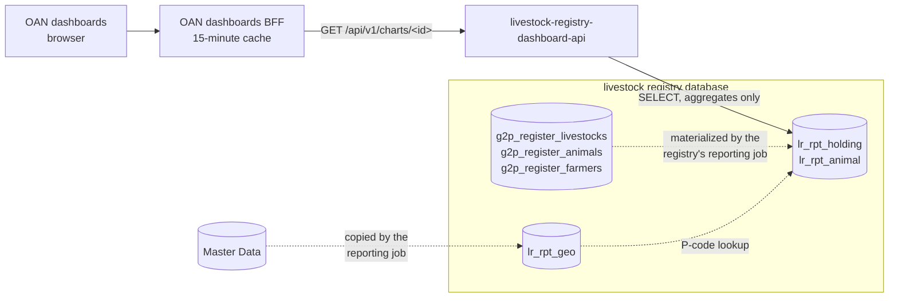

# Architecture

## Where the service sits

- The **dashboards BFF** is the only client. It maps each chart ID to one dashboard service, calls
  it with the dashboard's filters and caches the response.
- This service holds the only credentials for the livestock registry database that the dashboards
  path uses. It reads only the reporting views and returns aggregates.
- The **reporting views** belong to the livestock registry, not to this service. The registry's
  db-seed image ships `reporting_views.sql`; its Helm chart applies it on every install and upgrade
  and refreshes the views on a schedule.

## Data sources

| View | Grain | Used for |
| --- | --- | --- |
| `lr_rpt_holding` | one row per holding (`g2p_register_livestocks`) | keepers, holdings, geography, workflow state, registration trend |
| `lr_rpt_animal` | one row per animal line (`g2p_register_animals`), with the holding's geography and state carried down | head counts by species, breed, sex, health and vaccination status |

Columns worth knowing:

- `keeper_key`: a one-way hash of the keeper's id. `COUNT(DISTINCT keeper_key)` counts keepers
  without the service ever seeing an id.
- `keeper_gender`: from the keeper's farmer record, where the holding links to one.
- `heads`: the head count of an animal line. A poultry flock or a set of beehives is one line with
  a quantity, so animals are always `SUM(heads)`.
- `<level>_name` / `<level>_code` for region, zone, woreda and kebele. A holding records unit names;
  the view resolves them to P-codes against a copy of Master Data's geography (`lr_rpt_geo`). A
  name Master Data does not know keeps its name and has a NULL code, and the charts report it
  under `Unknown` rather than dropping it.
- `record_status` (`ACTIVE` for live records) and the workflow `state` (`DRAFT` …
  `VERIFIED`).

## Request flow

1. The BFF calls `GET /api/v1/charts/<chartId>?region=ET04&…`.
2. FastAPI binds the query parameters to `ChartFilters`.
3. The handler asks `build_where_clause` for a `WHERE` clause over the view it reads. Values are
   bound as `$1…$n`; only literal column names are interpolated.
4. One aggregate query runs on a pooled connection (two for the KPI endpoint, one per view).
5. The rows are returned as a JSON array.

## Design decisions

- **Reporting views, not register tables.** The register's schema belongs to the registry and
  changes with it. The views are the stable interface; a schema change is absorbed in the
  registry's own `reporting_views.sql`, reviewed with the change that caused it.
- **Materialized.** The views are refreshed by a CronJob, so a chart reflects the register as of
  the last refresh (every 30 minutes by default) plus the BFF's cache.
- **Geography by P-code.** The dashboards draw maps from boundary files keyed on P-codes and pass
  P-codes as filters, so the views carry codes and the API filters on them. Any of `ET04`,
  `region-ET04` or `REGION_ET04` is accepted.
- **Same contract as the other registries.** One array of rows per chart, the same filter names
  where the concept is shared, and the same error behaviour.
